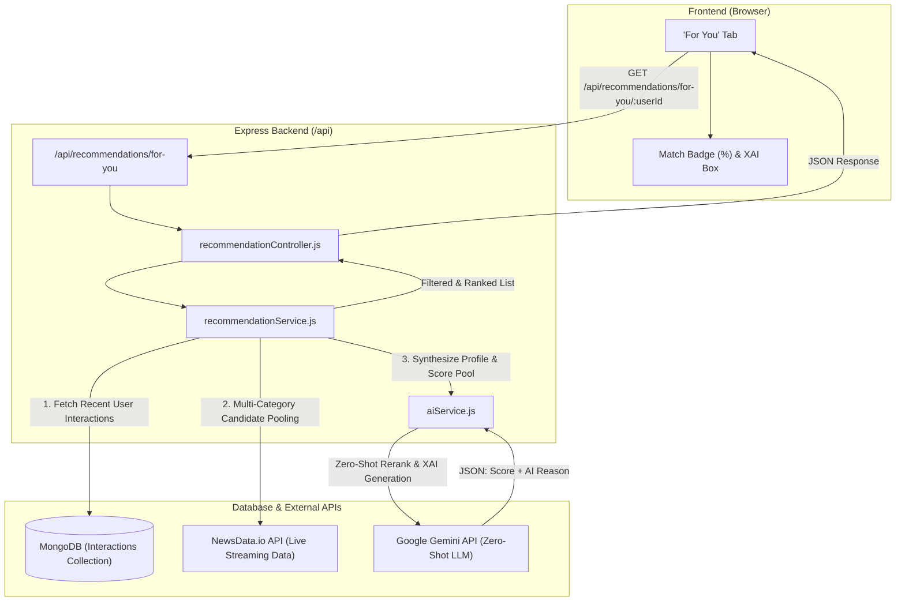

# Architecture & Data Flow: Real-Time LLM Personalization Engine (XAI)

## 1. Overview
The **Real-Time LLM Personalization Engine** in NewsLens-AI solves the traditional **Cold-Start Problem** on real-time news streams by replacing static offline machine learning models with **Zero-Shot LLM Reranking & Explainable AI (XAI)**.

---

## 2. System Architecture Diagram



---

## 3. Data Flow & Step-by-Step Processing

```
+-----------------------------------------------------------------------------------+
| 1. USER ACTION TRIGGER                                                             |
| User reads, likes, saves, or chats about articles -> Saved in MongoDB interactions |
+-----------------------------------------------------------------------------------+
                                         |
                                         v
+-----------------------------------------------------------------------------------+
| 2. CANDIDATE POOLING & INTENT EXTRACTION                                           |
| - RecService fetches top 10 recent interactions from MongoDB                      |
| - RecService fetches 25-30 live news candidates from NewsData API in parallel    |
+-----------------------------------------------------------------------------------+
                                         |
                                         v
+-----------------------------------------------------------------------------------+
| 3. ZERO-SHOT LLM RERANKING (Gemini)                                                |
| - Input: Recent User Interactions + Live Candidate Pool                           |
| - Gemini Prompt: Evaluates relevance (0-100%) & generates XAI explanation         |
+-----------------------------------------------------------------------------------+
                                         |
                                         v
+-----------------------------------------------------------------------------------+
| 4. IN-MEMORY FILTERING & SORTING                                                  |
| - Filter out scores < 60%                                                         |
| - Sort high to low by match score                                                 |
| - Attach 'score' and 'aiReason' to each article object                             |
+-----------------------------------------------------------------------------------+
                                         |
                                         v
+-----------------------------------------------------------------------------------+
| 5. FRONTEND RENDER WITH EXPLAINABLE AI                                             |
| - Display Match Score Badge (e.g., 94% Match)                                     |
| - Display XAI Explanation Box ("Why for you: Recommended because...")            |
+-----------------------------------------------------------------------------------+
```

---

## 4. Key Novelties for Academic / Presentation Use

1. **Zero-Shot Cold-Start Solution:** Handles brand new real-time news streaming instantly without offline model training.
2. **Explainable AI (XAI):** Every recommendation includes a human-readable explanation generated by Gemini.
3. **Dynamic Intent Synthesis:** User intent adapts instantly on every save or like.
